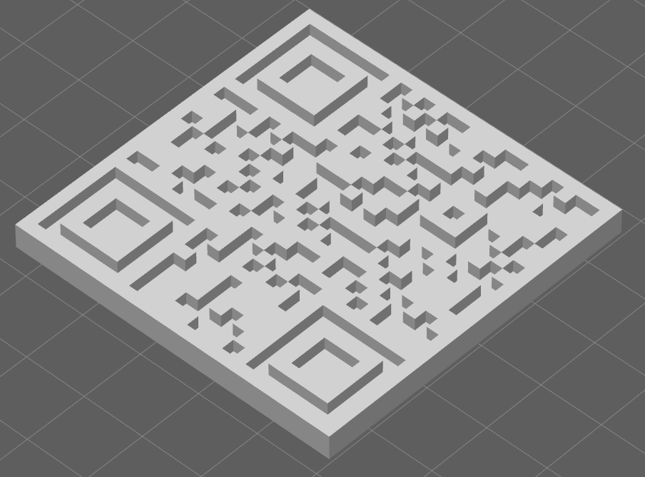

# QRCode3D
3D 可打印的二维码模型生成器

将二维码 3D 化，保存为 STL 文件，可用于 3D 打印。
建议用白色（浅色）材料打印，凹下去的部分，涂成黑色。



特性
- 支持增加中间 3D 图标
- 支持增加 3D 文字

```
Usage: D:\work\Cpp\QRCode3D\x64\Debug\QRCode3D.exe [-blockSize <blockSize>] [-padding <padding>] [-encoding <encoding>] [-format <format>] [-ecc <level>] <text> <output>
    -blockSize Block Size of generated model
    -height    Height of generated model
    -padding   Padding around barcode
    -encoding  Encoding used to encode input text
    -ecc       Error correction level, [0-8]
    -xxxx      Other configs passed to encoder (eg. version for QRCode)

Supported formats are:
    Aztec
    DataMatrix
    MaxiCode
    PDF417
    QRCode
Format can be lowercase letters, with or without '-'.
```
