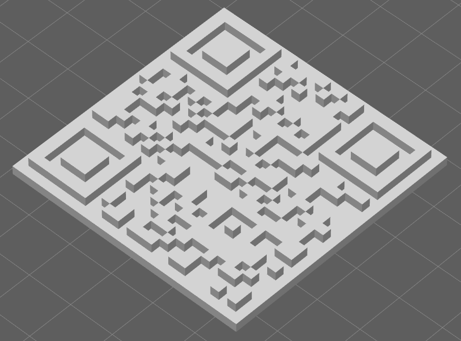

# QRCode3D
3D 可打印的二维码模型生成器

将二维码 3D 化，保存为 STL 文件，可用于 3D 打印。
建议用白色（浅色）材料打印，凹下去的部分，涂成黑色。



特性
- 支持增加中间 3D 图标
- 支持增加 3D 文字

```
QRCode3D [-blockSize <blockSize>] [-thickness <thickness>] [-padding <padding>] [-concave] [-convex] [-encoding <encoding>] [-format <format>] [-ecc <level>] <text> <output>
    -blockSize 每个小块的尺寸，默认 2.0 (mm)
    -thickness 模型厚度, 默认 4.0 (mm)
    -padding   四周边框大小，以小方块尺寸计算, default 1
    -format    二维码格式, default QRCode （兔子码）
    -encoding  文字编码
    -ecc       容错等级, [0-8]，默认 0
    -concave   二维码是凹陷的，这是默认值
    -convex    二维码是凸起的

Supported formats are:
    Aztec
    DataMatrix
    MaxiCode
    PDF417
    QRCode
Format can be lowercase letters, with or without '-'.
```
